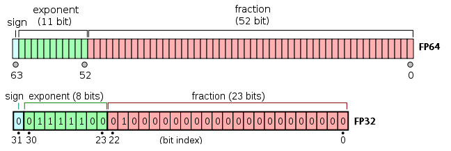

# Counting Money
## in C++

##### Maciej Gajewski

====

#### About me

* Maciek Gajewski [maciej.gajewski0@gmail.com](mailto:maciej.gajewski0@gmail.com)


Note:

* 30 years of programming, 20 years of C++
* 2000-2010 Wrocław (Pruftechnik, Tieto)
* 2010-2018 London, Amsterdam, 
* HFT, teaching (Tibra, Optiver)

====
<!-- .slide: data-background-image="img/KEN-WEBSITE-HEADER-uai-2064x1161.jpg" -->


Notes:

* Currently working for Kenetic, a HK-based company trading cryptocurrencies.
* End-to-end trading system
* Majority of the code in Python, but the fast bits in C++
* This presentation is about data types used in the C++ to store financial values
* I'm going to show excerpts from actual production code

====
<!-- .slide: data-background-image="img/huobi-btc-usdt_2020-04-25_16-03-52.png" -->
<!-- .slide:data-background-size="contain" -->


Notes:

* What values do we need to store?
 - price depth, trades, postions
* On this picture: Huobi BTC/USDT, 2020-04-25 16:03
* Introducing price depth:
    - Simple price is not enough
    - At the core of every exchange as a device called 'matching engine'
    - Matching engine stores all active orders for an instrument (order book)
    - When new order is entered, it is matched with existing orders
    - Example - buying or selling 1 BTC
    - If there is no match, the order (possibly) joins the book
    - If the is a match, trade happens (rightmost panel)
    - What we see is 'price depth', a view of the oder book
* Old picture

https://www.binance.com/pl/trade/BTC_USDT
https://www.huobi.com/en-us/exchange/btc_usdt/
https://www.bitmex.com/app/trade/XBTUSD

----

<!-- .slide: data-background-image="img/bitmex-btc-usd_2021-03-29_10-51-43.png" -->
<!-- .slide:data-background-size="contain" -->


====

## Price depth

``` cpp
using Price = ???;
using Quantity = ???;

struct DepthLevel {
  Price mPrice;
  Quantity mQty;
};

using DepthLevels = std::vector<DepthLevel>;

struct Depth {
  DepthLevels mBids; // sorted by price, descending
  DepthLevels mAsks; // sorted by price, ascending
};

```

Notes:

This is the C++ representation of Price Depth.
It's fairly simple.
The only missing bit are the Price and Quantity types.

====

## Requirements for the type

* Exact ==
* Comparison, <, <=, >, >=
* Arithmetics: +, -, +=, -=
* No loss of precision!
* conversion to/from string

Notes:

* The type must be fast. If don;t need speed, we use Python
* Depth diffs and multi-depth operations require operators to be fast!

====

## What are the options

1. floating point numbers
2. fixed point numbers
3. decimal floating point
4. arbitrary precision

Notes:

These are the options that come to mind when looking for a suitable type

====

### Floating point types

float, double : IEEE 754



```
value = mantissa * 2^exp
```

Notes:

* We have our good'ol floating point types built into the language and the CPU
Image source: https://www.thecrazyprogrammer.com/2018/04/single-precision-vs-double-precision.html

====

### Floating point types

Pros:

* Fast
* Available out of the box

Notes:

* The built-in floating point types are fast, they are handled by the CPU itself (on arch of interest, ie x86-64)
* They are readily available, with the entire complement of operations

====

### Floating point types

Cons:

* Inexact equality comparison
* Silent loss of precision

_What Every Programmer Should Know About Floating-Point Arithmetic_
https://floating-point-gui.de/

Notes:

* There is a fantastic article called _What Every Programmer Should Know About Floating-Point Arithmetic_

====

### Floating point types

Bad at storing decimal numbers

``` cpp
0.1 + 0.2 = 0.30000000000000004441
```

Notes:

* Example form the article (expanded to 20 decimal palces)
* Floating point numbers are famously bad at storing decimal fractions
* Note on this example - there is nothing wrong with addition. The problem is 
in the fact that neither 0.1 nor 0.2 have binary representation

====
<table>
<tr><td>0.1<sub>2</sub></td><td> = </td><td>0.5<sub>10</sub></td></tr>
<tr><td>0.01<sub>2</sub></td><td> = </td><td>0.25<sub>10</sub></td></tr>
<tr><td>0.001<sub>2</sub></td><td> = </td><td>0.125<sub>10</sub></td></tr>
<tr><td>0.0001<sub>2</sub></td><td> = </td><td>0.0625<sub>10</sub></td></tr>
<tr><td>0.00001<sub>2</sub></td><td> = </td><td>0.03125<sub>10</sub></td></tr>
</table>

Notes:

Binary fractions can be precisely stored in decimal.

====

<table>
<tr><td>0.1<sub>10</sub></td><td> = </td><td>0.0(0011)<sub>2</sub></td></tr>
<tr><td>0.2<sub>10</sub></td><td> = </td><td>0.(0011)<sub>2</sub></td></tr>
<tr><td>0.3<sub>10</sub></td><td> = </td><td>0.01(0011)<sub>2</sub></td></tr>
<tr><td>0.4<sub>10</sub></td><td> = </td><td>0.0(1100)<sub>2</sub></td></tr>
<tr><td>0.5<sub>10</sub></td><td> = </td><td>0.1<sub>2</sub></td></tr>
</table>

Notes:

System dwójkowy popradzi sobie z połówką, ale z 0.7 już nie :)

====

### Floating point types

Inexact comparison

```cpp
double a = parse1("1234.56789");
double b = parse2("1234.56789");
assert(a == b);

std::map<double, T> map;
map[a] = data;
assert(map.find(b) != map.end());
```

Notes:

* The build-in comparison is bitwise
* The same value, after some operations, can slightly differ
* Even using different string parser, ie JSON vs database input, can yield different bits
* The solution: create a "compare with tolerance", but this is slow (and incorrect)
* Trying to use double as a key in a map is an invitation to a world of pain
* I've seen this done, working for years, and then suddenly not working in mature, production code,
* ... poor programmers looking for a for a fix whole night

====

## Arbitrary precision types

* Boost.Multiprecision
* GMP - https://gmplib.org/
* MPDEC (Python's Decimal) - https://www.bytereef.org/mpdecimal/

Notes:

* Arbitrary precision types have no rounding/precision issues
* Bat are universally slow
* We are confined by the limits of our CPU!

====

## Arbitrary precision types

``` c
#include <mpdecimal.h>

typedef struct mpd_t {
       uint8_t flags;       // [memory flags] | [specials] | sign
       mpd_ssize_t exp;     // exponent
       mpd_ssize_t digits;  // number of decimal digits
       mpd_ssize_t len;     // number of words in use
       mpd_ssize_t alloc;   // number of allocated words
       mpd_uint_t *data;    // words
} mpd_t;
```

Notes:

* This is data-type used internally by MPDEC
* One can see a variable-sized, heap allocated part.

====

## Decimal floating point types

* Defined by IEEE 754-2008

```
value = 10^exp * mantissa
```

Notes:

Decimal floating point is defined by IEEE 754-2008.
It is more complex than the floating point, as the standard
allows for two storage formats: binary and BCD

====

## Decimal floating point types

Pros:

* Readily available (as `std::decimal32,64,128`)
* No rounding issues

Notes:

* GCC STD lib provides decimal implementation
* There is no rounding issues, no phantom digits
https://gcc.gnu.org/onlinedocs/libstdc++/latest-doxygen/a01578.html


====

## Decimal floating point types

Cons:

* Possible precision loss
* Not supported by HW (SLOW)

Notes:

Precision loss is s till possible when accumulating.
For decimal128, the mantissa is 110 bits
There is no hardware support, everything in software

----

```cpp
#include <decimal/decimal>

using Price = std::decimal::decimal64;
using Quantity = std::decimal::decimal64;

auto findLevel(DepthLevels& levels, const Price& p) {
    return std::find_if(levels.begin(), levels.end(), [&](auto& l) {
         return l.mPrice == p;  });
}

auto accumulateQty(const DepthLevels& levels) {
    return std::accumulate(
        levels.begin(), levels.end(), Quantity{0},
        []( const Quantity& q, const DepthLevel& l) {
            return t.mQty + q;
        }
    );
}
```

Notes:

Simple example - accumulating traded quantity

----

## Decimal floating point types

```x86asm
movdqa  xmm5, XMMWORD PTR [r14]
movdqa  xmm0, XMMWORD PTR [r13+0]
movdqa  xmm1, xmm5
movaps  XMMWORD PTR [rsp], xmm5
call    __bid_eqtd2
test    rax, rax
je      .L14
add     r13, 32
jmp     .L26
```

```x86asm
movdqa  xmm1, XMMWORD PTR [rbx]
add     rbx, 32
movdqa  xmm0, XMMWORD PTR [rsp]
call    __bid_addtd3
cmp     rbx, rbp
movaps  XMMWORD PTR [rsp], xmm0
jne     .L65
movdqa  xmm0, XMMWORD PTR [rsp]
add     rsp, 24
pop     rbx
pop     rbp
ret
```

====

## Decimal fixed point

```
value = 10^-EXPONENT * mantissa
```

Notes:

* We store thew value as a simple integer, 
* And we interpret it as a number of small quanta
* The exponent is arbitrary and fixed


====

### How to pick an exponent

* Usually exchanges offer a precision of 6-9 digits after comma
* To store value (price * quantity), you need 18 digits
* Exponent: 10^18

Notes:

Exchanges usually offer 6-9 digits of precision.
To store a value (price*quantity)m we need 18 digits.

====

```cpp
template<typename Tag>
class Decimal {
public:
    static constexpr int FRAC_DIGITS = 18;
    constexpr Decimal() = default;
    constexpr Decimal(const Decimal &) = default;
    constexpr Decimal(Decimal &&) = default;

private:
    constexpr explicit Decimal(storage_t v) 
        : mValue(v) {}

    storage_t mValue = 0;
};

using Price = Decimal<struct PriceTag>;
using Quantity = Decimal<struct QuantityTag>;

```

Notes:

This is the code that emerges.
It uses template parameter to create string types, to provide separation.

What is storage_t?

====

```cpp
constexpr double toDouble() const {
    return double(mValue) / std::pow(10, FRAC_DIGITS);
}


constexpr std::int64_t toInt() const {
    static_assert(FRAC_DIGITS == 18);
    return std::int64_t(mValue / 1'000'000'000'000'000'000);
}

```

Notes:

The goal of the static_assert is to attract attention to the function
(and to the constant used within) when FRAC_DIGITS changes

====

### How many bits do we need?

```
MIN_VALUE = 10^-18

storage_t = int64 => MAX_VALUE = 2^63 * 10^-18 = 9.22337

storage_t = int128 => MAX_VALUE = 2^127 * 10^-18 = 1.7E20
```

Notes:

64 bit integer simply doesn't cut it.
64 bit offers only 19 decimal digits, with 18 after comma, we get only one before
128 bits offers 38 bits (twice as much, makes sense!)

QUESTION: Where are we going to get 128 integer

====

```cpp
#pragma GCC diagnostic push
#pragma GCC diagnostic ignored "-Wpedantic"
  using storage_t = __int128;
#pragma GCC diagnostic pop

static constexpr int INT_DIGITS = 20;
static constexpr int FRAC_DIGITS = 18;
static constexpr int TOTAL_DIGITS = INT_DIGITS + FRAC_DIGITS;
```

Notes:

... IT turns out it is available in gcc and clang out of the box

Many operations are not supported in hardware,
but basic things, like addition, subtraction, comparison,
compiles to raw assembly.

====

```cpp
static constexpr Decimal fromInt(std::int64_t v) {
    static_assert(FRAC_DIGITS == 18);
    storage_t s = storage_t(v) * 1'000'000'000'000'000'000;
    return Decimal(s);
}
```

Notes:

Conversion from integer is trivial and fast, single imul instruction.
(see rabbit hole if time permits)

----

### Conversion from int


```x86asm
fromInt(long):
    movabs  rax, 1000000000000000000
    imul    rdi
    ret
```

Notes:

The runtime version is very efficient

----

```cpp
// earlier version
static constexpr Decimal fromInt(std::int64_t v) {
    storage_t s(v);
    for (int i = 0; i < FRAC_DIGITS; i++) {
      s *= 10;
    }
    return Decimal(s);
}
```

Notes:

I assumed that, since the function is constexpr, the generated
code will be super-efficient.
I didn't even crossed my mind to verify this.

----


```x86asm
fromInt(long):
    mov     rax, rdi
    sar     rdi, 63
    mov     ecx, 18
    mov     rdx, rdi
    mov     edi, 10
.L6:
    imul    rsi, rdx, 10
    mul     rdi
    add     rdx, rsi
    sub     ecx, 1
    jne     .L6
    rep ret
```

Notes:

But alas... gcc is generating bad code.
Clang does it right, but gcc not.
(using gcc 7.4, but even gcc 10 fails, even with -O3)

====

```cpp
static Decimal fromDouble(double d) {
    storage_t s = d * 1E18; // right ???
    return Decimal(s);
}
```

Notes:

It should be simple, right?
Binary-to-decimal conversion is exact.

====


0.1 + 0.2 = 0.30000000000000004441


2^52 = 4.5E+15

====

<table>
<tr><th>input</th>          <th>double</th></tr>
<tr><td>0.1 + 0.2</td>      <td>0.<u>300000000000000</u>04441</td></tr>
<tr><td>0.07</td>           <td>0.0<u>700000000000000</u>0666</td></tr>
<tr><td>123.456</td>        <td><u>123.456000000000</u>00307</td></tr>
<tr><td>987654321e+10</td>  <td><u>987654320999999</u>8976</td></tr>
</table>

Notes:

One can see that only 15 decimal digits of double can be trusted.
Need to introduce a concept of 'rank'

====

<table>
<tr><th>input</th>          <th>double</th> <th>rank</th></tr>
<tr><td>0.1 + 0.2</td>      <td>0.<u>300000000000000</u>04441</td>  <td>0</td></tr>
<tr><td>0.07</td>           <td>0.0<u>700000000000000</u>0666</td>  <td>-1</td></tr>
<tr><td>123.456</td>        <td><u>123.456000000000</u>00307</td>   <td>3</td></tr>
<tr><td>987654321e+10</td>  <td><u>987654320999999</u>8976</td>     <td>19</td></tr>
</table>

Notes:

'Rank' is the number of significant digits before the decimal point.
It may be negative for small fractions

====

```cpp
static constexpr int TRUSTWORTHY_DIGITS_IN_DOUBLE = 15;

static constexpr std::array<double, Decimal::TOTAL_DIGITS + 1>
    DOUBLE_POWERS10{1E-18, 1E-17, ..., 1E20};

static_assert(DOUBLE_POWERS10[FRAC_DIGITS] == 1.0);

int findRank(double d) {
    assert(d >= 0);
    auto it = std::find_if(
        DOUBLE_POWERS10.begin() + TRUSTWORTHY_DIGITS_IN_DOUBLE,
        DOUBLE_POWERS10.end(),
        [&](double e) { return e > d; });
    
    if (it == DOUBLE_POWERS10.end())
        throw std::range_error("Double out of Decimal range");

    return it - DOUBLE_POWERS10.begin() - FRAC_DIGITS;
}
```

Notes:

This code is using a lookup table to finds the rank of a double.

----

</img>

```cpp
auto it = std::find_if(
        p.begin(),
        p.end(),
        [&](double e) { return e > d; });
```
vs
```cpp
auto it = std::upper_bound(
    p.begin(), 
    p.end(),
    d);
```

Notes:

This has been discussed on our Wro.cpp slack!

====

```cpp

static Decimal fromDouble(double v) {
    double d = std::abs(v);

    if (d < DOUBLE_POWERS10.front())
        return Decimal(0);

    int rank = findRank(d);
    int decimals =  
        TRUSTWORTHY_DIGITS_IN_DOUBLE - rank;
    d *= DOUBLE_POWERS10[FRAC_DIGITS + decimals];
    
    storage_t s = storage_t(std::round(d));
    s *= POWERS10[FRACTION_DIGITS - decimals];

    if (v > 0) return Decimal(s);
    else return Decimal(-s);
}
```

====

The last slide:

* TODO: this presentation
* maciej.gajewski0@gmail.com
* https://floating-point-gui.de/